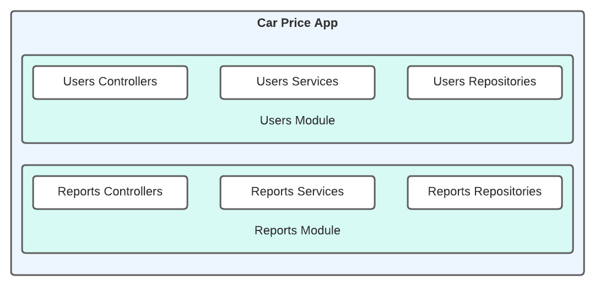
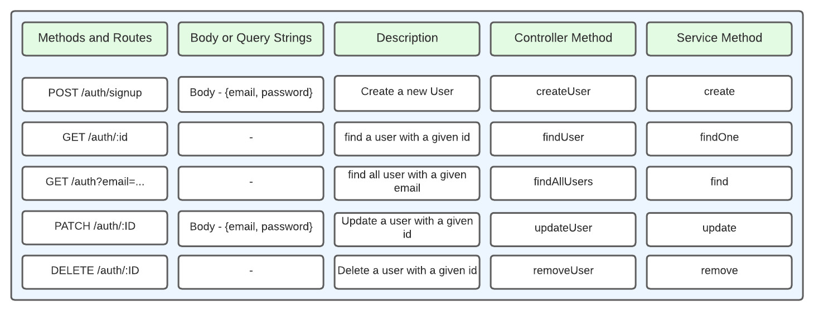
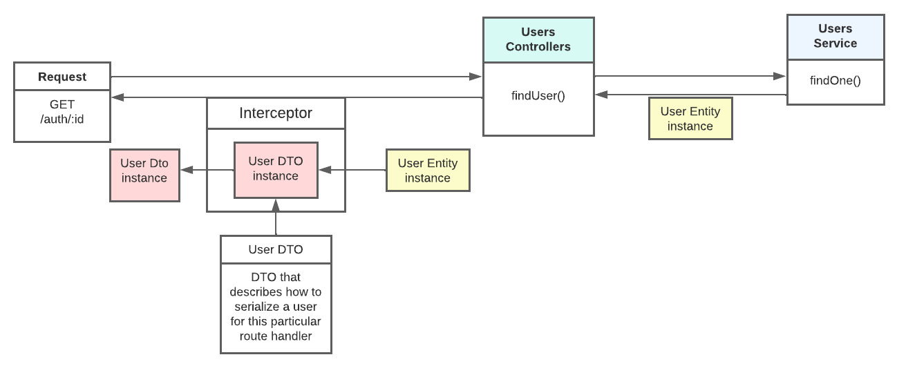
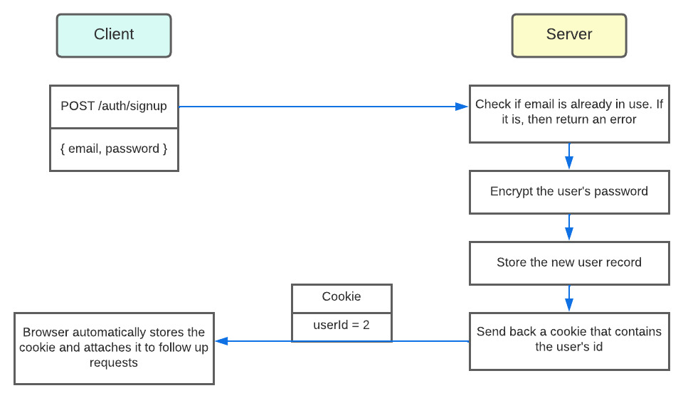

# Car Price App
## Exercise using NestJs, Typeorm and SQLlite

Because this is an exercise, the app uses sqllite and the Typeorm sinchronize is set true for development porpouse.
Many of the routes does not make sense in a real app, but those are there for practicing with Typeorm.
The hooks that are also inside the user entity are for helping visualize the process.
We also use the methods from the [Repository API](https://typeorm.io/repository-api).

## Structure of the app

## Users module routes

## Custom Serialization Interceptor
With a custom decorator

## User authentication
The authentication service uses the users services.
It stores the hashed password with a random salt to prevent rainbow table attacks, and the signin process send a cookie with the Cookie-Session library.
This choice is to show a classic, tried-and-true approach using cookies. But can be used the JWT approach instead.
There is also a guard and a custom decorator to check the current user from the request.

## Testing unit for auth service
Creation of a unit testing for the auth service with a mock of UsersService

## Testing unit for the users controller
Testing running with mock versions of auth service and user service.
Not All methods are tested, just the ones I find more important.

## End-to-end Test
For the test, we created a separate sqllite db, which is wipe out after the test conclusion. Nestjs recommended best practices are followed.
We set the node_env to correctly choose between the development or test environment.